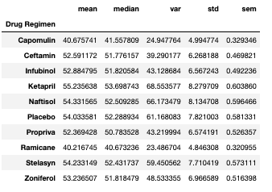
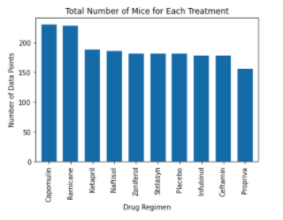
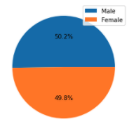
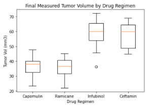
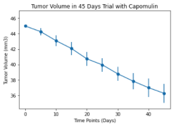
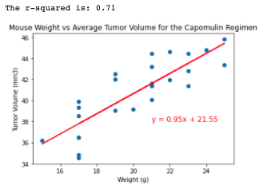

# Skin Cancer Drug Test Analyses with Pandas and Matplotlib

* I was given an access to an animal study with cancer treatments. In this study, 249 mice identified with SCC tumor growth were treated through a variety of drug regimens. Over the course of 45 days, tumor development was observed and measured. The purpose of this study was to compare the performance of a drug, Capomulin, versus the other treatment regimens. I generated all of the tables and figures needed for the technical report of the study. 

## Instructions

* Before beginning the analysis, I checked the data for any mouse ID with duplicated time points and I removed any data associated with that mouse ID.

* I used the cleaned data for the remaining steps.

* I generated a summary statistics table consisting of the mean, median, variance, standard deviation, and SEM of the tumor volume for each drug regimen.

** Summary Table

* I generated a bar plot using both Pandas's `DataFrame.plot()` and Matplotlib's `pyplot` that showed the number of total mice for each treatment regimen throughout the course of the study.

** Bar plot

* I generated a pie plot using both Pandas's `DataFrame.plot()` and Matplotlib's `pyplot` that showed the distribution of female or male mice in the study.

** Pie plot

* I calculated the final tumor volume of each mouse across four of the most promising treatment regimens: Capomulin, Ramicane, Infubinol, and Ceftamin. I calculated the quartiles and IQR and quantitatively determined if there were any potential outliers across all four treatment regimens.

* Using Matplotlib, generated a box and whisker plot of the final tumor volume for all four treatment regimens and highlighted any potential outliers in the plot by changing their color and style.

** box and whisker plot

* Selected a mouse that was treated with Capomulin and generated a line plot of time point versus tumor volume for that mouse.

** Time series graph

* Generated a scatter plot of mouse weight versus average tumor volume for the Capomulin treatment regimen.

* Calculated the correlation coefficient and linear regression model between mouse weight and average tumor volume for the Capomulin treatment. Plotted the linear regression model on top of the previous scatter plot.

** Correlation and Regression Analyses

### Summary
* In this study, 249 mice identified with squamous cell carcinoma tumor growth were treated with Capomulin, and other drug regimens. The ratio of male and female mice used for this study was 50.2% and 49.8%, respectively. Therefore, the results in this study would not be biased by sex. 

* The total number of mice used for each drug treatment showed that the numbers of samples with Capomulin and Ramicane treaments (230 mice for Capomulin and 228 mice for Ramicane) were larger than the sample numbers in the other drug treatments (less than 200 mice). The result might suggest that mice with Capomulin and Ramicane treaments survived better through the 45 days experimental trial compared with mice with the other drug regimens; therefore, there were more samples available in Capomulin and Ramicane treaments for data analyses. 

* The comparison of the final tumor volume of each mice among the drug treatments of Capomulin, Ramicane, Infubinol, and Ceftamin, showed that the tumor volume in the treatment of Capomulin and Ramicane was much smaller than the tumor volume in the treatment of Infubinol and Ceftamin. However, Infubinol treatment data contained an outlier value. We might need to consider the outlier value carefully whether we need to remove it or not, in the future analyses. 

* The graph of the tumor volume in the 45 days experimental trial with the Capomulin treatment showed that the tumor volume decreased through the experimental days. The result might suggest the beneficial use of Capomulin for the skin cancer treatment. 

* There was a significant correlation between mice weight and tumor volume in the Capomulin treatment (Pearson's R = 0.84). In addition, there was a positive relationship between mice weight and the average tumor volume of each mice ID in the Capomuline treatment. The larger mice had larger tumor volume compared with the small mice. The result suggested that mice weight was an important variable (i.e., covariate) to understant the effect of Campomulin on the tumor volume. Therefore, further analyses would be needed (i.e., Analyses of Covariate (ANCOVA)) to consider the effect of the sample body weight on the tumor volume. 

